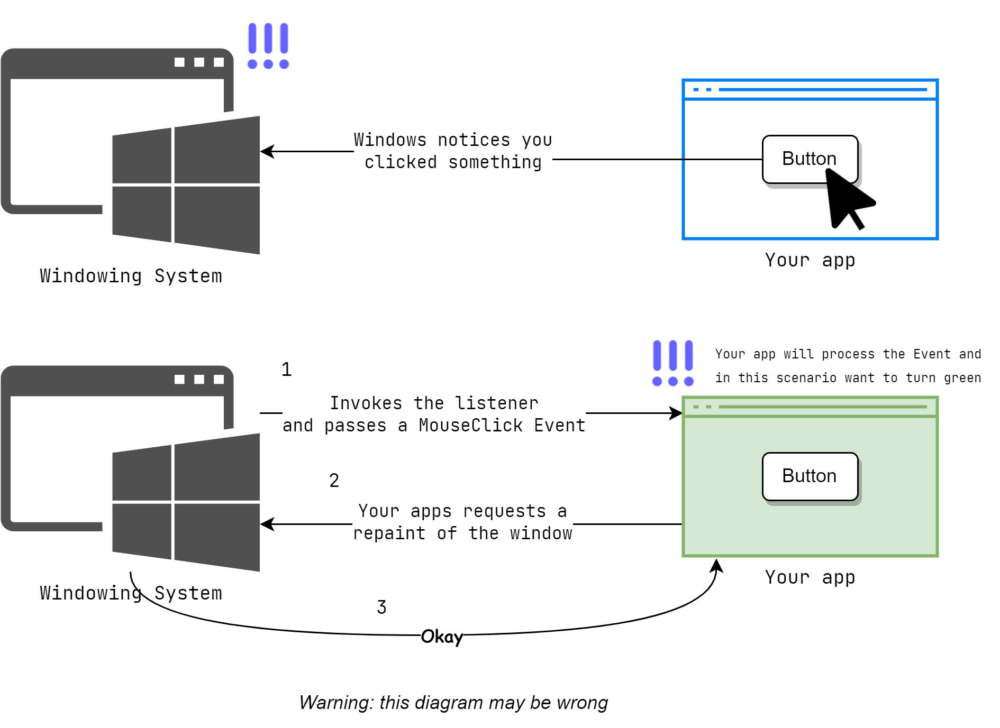

<link rel="stylesheet" href="../Resources/styles/base.css">
<!---This is for enabling LaTeX rendering in exports--->
<!---                  Do not remove                --->

<script type="text/javascript" src="http://cdn.mathjax.org/mathjax/latest/MathJax.js?config=TeX-AMS-MML_HTMLorMML"> 
</script>

<script type="text/x-mathjax-config">
MathJax.Hub.Config({ tex2jax: {inlineMath: [['$','$']]}, messageStyle: "none" });
</script>

## Stages of Design
### General design stages
##### Pre-Design
Identify core concept and objectives.

We need to ask what the product is about and who the product is for.

We also need to decide on what technologies to utilize throughout development.

So a thorough research and anlysis is done at this stage.

Several outcomes of this stage are:
1. What the creative vision is and the objectives for both users and business perspectives
2. The best approach to development (Eg: Native Installation, or webapp?)
3. Rough system architecture designs
4. A roadmap/plan for developing the project

But at the end, we should be able to answer most of these questions:
- Have i established what my users want?
- Wahts the point of the project?
- What technologies are best
- What problem is thee project fixing?
- Have i compared to similar ideas in the same industry
- Should it be a standalone app, or a module for something else.
##### Design
This is where the UI/UX of the application is conceived until we have a blueprint for developers to build.
Steps included are 
- Making a wireframe (Skeleton of the interface)
- Visual and aesthetic decisions
- Discussion with stakeholders (client)
- Prototyping
- Testing (Eg: SUS Survery)\

Outputs:
- The wireframe plan
- Final designs for all screens
- Interactive prototype
- Technical specification

##### Development
This is when the plans from the design stages are carried out.

The team carries through following a development methodology like Agile, or waterfall depending on what suits them.

Throughout the development,they will routinely have quality assurance and user acceptability testing.

Some very important considerations during development are:
- Security ❗❗❗
- Data sources
- First and final releases

##### Support
The last stage in application development is simply maintaining the written app.

Developers will write bug fixes to the existing app and may introduce new features if desired.

Some maintaineance updates arent centered just around bug fixes, they may be performance optimizations, or adjustment to the new enviroment (New OS, New Security policy, New Hardware)

## About the Desktop Enviroment


### The desktop enviroment
These frameworks in common, work with your OS to use Windows, Icons, Menus and Pointers (WIMP) to render an interface.

Your desktop can be described as a big board, where many apps can have smaller boards with information that you can move and interact with a pointer, likely the mouse.

It has these enviroments that make it possible:
- Windowing system, handles I/O
- Widget Toolkit, draws windows and delegates events to the application
- Window manager, manages the windows so you can move them and stuff

### Events

Events are stuff that happens. In app development, its an object that contains data about what happened (Eg: User clicks something, user types something, computer finds an error, file changed, etc. )

#### Event Handling
The windowing system dispatches events that happen to the right widget on the right window.

For example, for keyboard events, they are sent to whichever widget has **input focus**.

Developers can write event handlers that react to the event and invoke other application logic.

#### Rendering
Widgets and windows can have a visual representation thanks to the windowing system, they can send commands for painting.

The windowing system often doesnt need to redraw the entire widget, just the parts that changed. (Eg: Overlayed windows)


#### Mock Scenario
The diagram below shows a mock scenario where the user clicks a button on your app that makes the window turn green.



##### The GUI event loop
1. GUI app starts
2. Widgets are setup
3. Event loop begins
4. Waits for events in the **event queue** provided by the windowing system
5. Dispatch events to the right widget and handler
6. Repeat from 4

## Java Swing Framework
### About Swing
The swing framework is one of the many UI frameworks for Java (Eg: AWT💩, QT, SWT, JavaFX)

If you are from other languages, they are like Rust's Tauri, Python's Tkinter💩, Dart's Flutter, etc.

The swing framework is actually built ontop of java's older AWT Framework. It provides more GUI componenets and features for developers and allows changing the look and feel easily.

### Principles of Swing
The Swing framework makes an abstraction of the UI as a hierarchy of widgets(Eg: JButton, JLabel, JPanel).

It also follows the MVC architecture, where you have a model or the data source, the controller or your code and the view, which is Swing.

It communicates between the enviroment through event objects captured by event listeners. In swing, event listeners receive the event object as a parameter, below is an example snippet.
```
ActionListener myEventListener = new ActionListener {
    @Override
    public void actionPerformed(ActionEvent event) {}
}
```
### Swing Widgets
Some examples include:
##### Top-level containers
- JFrame
- JDialog
- JWindow
##### Logical Containers
- JPanel
- JScrollPane
- JTabbedPane
- JSplitPane
##### Widgets
- JLabel
- JTextField
- JCheckBox
- JList
- JProgressBar
- JMenu
- JRadioButton
- JFileChooser
- JTree
- JTextPane
- JTable