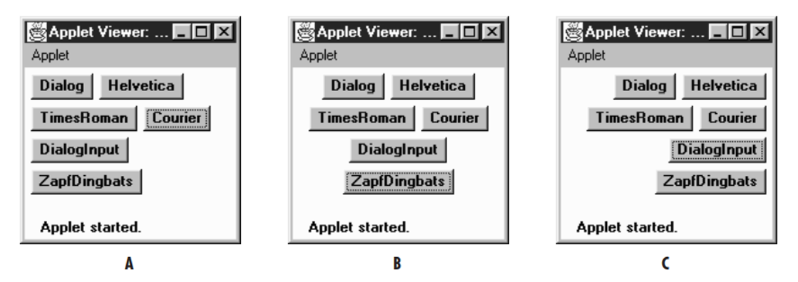

<link rel="stylesheet" href="../Resources/styles/base.css">
<!---This is for enabling LaTeX rendering in exports--->
<!---                  Do not remove                --->

<script type="text/javascript" src="http://cdn.mathjax.org/mathjax/latest/MathJax.js?config=TeX-AMS-MML_HTMLorMML"> 
</script>

<script type="text/x-mathjax-config">
MathJax.Hub.Config({ tex2jax: {inlineMath: [['$','$']]}, messageStyle: "none" });
</script>

# Application Development Module 2

## Swing Layout Managers
A Java AWT object that automatically defines the position of widgets within a containere for you. Most Layouts will override any position you set, deffering to their own calculated position instead.

### FlowLayout
The default layout a JPanel has.

This layout arranges components in order, from left to right. If the container cannot fit the component, it will be added in the next row at the bottom.

The layout automatically repositions the components when the container resizes.

Components can have a preferred size, taking available space.

If there are too many componenets and too little space, the components can be clipped and you wont see all of it.

A Flowlayout can prefer to align things, simply pass this in the constructor.

```java
public FlowLayout(int alignment, int hgap, int vgap)
```

### BorderLayout TODO
The default for a top-level JWindow or JFrame.
> A JFrame or JWindow is a container that provides a window interface to interact with. JPanels on the other hand are merely logical containers.
>

The BorderLayout has 5 regions, North, South, West, East and Center.

Components can be added to any of those regions, unused space from other regions can be given up for another region.

Components inside tend to fill all the space of the region.

```java
public BorderLayout(int hgap, int vgap)
```

### GridLayout TODO
### GridBagLayout TODO
Unlike BorderLayout, the GridBagLayout sizes components to their preferred sizes rather than trying to fill up space.

### CardLayout TODO

## Principles of Designing UI
- Functional based form. The appearance of an object should reflect or allude to its purpose. (Eg: A disabled button should be grayed out and flat)
- Visibility. It should be easy for a user to find functions in a program, too many elements at once may make it challenging.
- Strong Mapping, 
- Feeedback. The system should provide information about their action, for example buttons become dented when pressed, or make a sound when clicked.
- Affordance
- Consistency, elements should be designed with consistency to make it comfortable, and to help the user let inutition guide them.
- Forgiveness, software should include features to help user avoid or recover from mistakes. (Eg: A confirmation prompt, auto saving, etc.)
- Minimalism, a deliberate reduction in complexity for the user's sake

### Dueling Principles
Some principles tend to clash, or it might not be possible to have all principles. A compromise must be made based on what the user needs.
### Fitts' law
It states that the time to reach an element with the cursor depends on the distance and size of the element.

Larger buttons are much easier to click than smaller ones. And the position of the element relative to the cursor is important.


## Java Persistence API
An open source API made by Oracle for accessing and managing data of the database as java objects.

It defines a object-relational mapping (ORM) a standard method for mapping java classes to their database counterpart.

Classes can be mapped to database objects through annotations. Frequentely this information is stored in the meta information file.

It is not strictly 1 to 1. A java entity can be mapped to a set of columns for more than one table.

### Steps to register a java entity with the ORM

1. Import the persistence API
```java
import javax.persistence.*;
```
2. Create an entity manager factory
```java
EntityManagerFactory mangerFactory = new EntityManagerFactory("db_name");
```
3. Obtain the entity manager
```java
EntityManager entityManager = managerFactory.createEntityManager();
```
4. Initialize the entity manager
```java
entityManager.getTransaction().begin();
```
5. Provide the new data through your java entity
```java
Student student1 = new Student();
student1.setId(1);
student1.setName("John");
```
6. Persist the object
```java
entittyManager.persist(student1);
```
7. Close up the transaction and release the factory resources
```java
entityManager.close();
managerFactory.close();
```