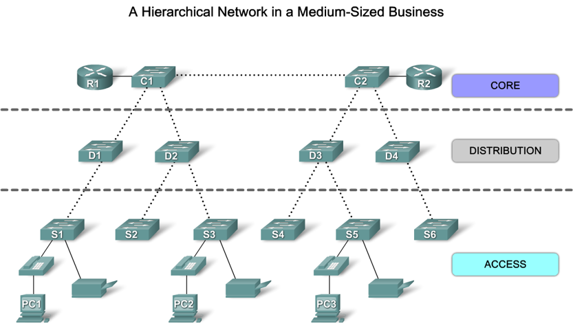
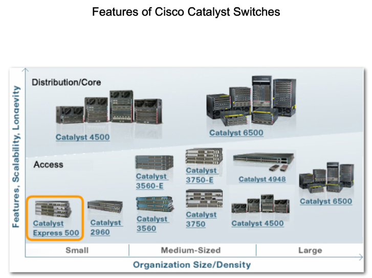
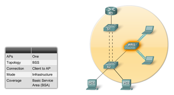
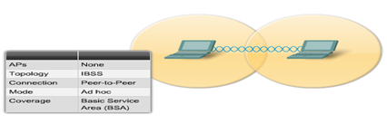
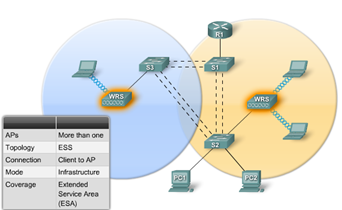

<link rel="stylesheet" href="../Resources/styles/base.css">

<!---This is for enabling LaTeX rendering in exports--->
<!---                  Do not remove                --->

<script type="text/javascript" src="http://cdn.mathjax.org/mathjax/latest/MathJax.js?config=TeX-AMS-MML_HTMLorMML"> 
</script>

<script type="text/x-mathjax-config">
MathJax.Hub.Config({ tex2jax: {inlineMath: [['$','$']]}, messageStyle: "none" });
</script>

# Cisco Introduction to Scaling Networks 
## The hierarchical network model


The general Purpose of each layer:
- Core, The backbone of traffic of the network, also is where the network can conenct to the rest of the internet
- Distribution, aggregates traffic from the access layer before moving to the core layer
- Access, the interface for users where end devices can connect and access the network


Benefits of designing a network in this fashion:
1. Scalable, can be easily expanded to accomodate more users
2. Redundant, distribution and core redundancy makes the network less likely to fail entirely
3. Performance, 
4. Security, implementing port security and other policies at the access layer make the network secure
5. Manageability, consistent configurations among switches make management simple
6. Maintainability, the structure allows expansion without making the network too complex to work with.

Key principles to make the hierarchical network effective:
- Keeping network diameter at a minimum(number of devices data has to go through before arriving at the destination)
- Bandwitdth aggregation, some switches can use etherchannel to increase the bandwidth for traffic
- Redundancy, investing in many network devices to provide multiple paths for data to travel mitigates failure.

## Shopping the right cisco switch
Cisco switches generally come in 3 groups:
- Fixed switches, these are switches that intend to work out of the box. They do not have any cuztomizable options.
- Modular configuration switches, these are switches that can have interfaces to plug in custom components
- Stackable switches, these are switches that can be stacked...



## Port Security
One way hackers can attack a network is by providing bogus MAC replies.

Hackers can cause a DoS by flooding the switch's MAC Table with fake addresses, new legit clients are unable to forward to be fowarded to because the switch cant remember any more mac addresses.

Or hackers can fake a machine identity by providing the mac address of a legit computer, causing the fowarded frames to be sent to the hacker.

Port security allows the switch to check if the mac address is truted before fowarding.

#### Enable port secuirty

```
S1(config-if)# switchport mode access
S1(config-if)# switchport port-security
```

#### Set maximum addresses
Set maximum number of addresses able to use the port
```
Switch(config-if)# switchport port-security maximum 8192
```

#### Configure trusted MAC Addresses
##### Static
```
Switch(config-if)# switchport port-security mac-address 68-ff-7b-1d-3d-e9
```
##### Dynamic
The device remembers whatever address was in the mac table. So the currently connected device is trusted. This information is gone when the switch restarts.

However this information is lost on reboot
```
Switch(config-if)# switchport port-security
```
##### Sticky
The dynamically learned addresses are saved to the running config, which you can later save to the startup.
```
Switch(config-if)# switchport port-security mac-address sticky 
```
#### Port Aging
You can also configure the trusted mac addresses to expire. Whether static or dynamic.

##### Configure expiration life
The time range is anywhere from 0 to 1440 minutes.
```
S1(config-if)# switchport port-security aging time 10 
```
##### Configure expiration type
There are 2 types of expiration
- **inactivity**, secure addresses are removed when no traffic with the source address exists for some time.
- **absolute**, secure addresses are removed at a certain time, regardless active or inactive.
```
S1(config-if)# switchport port-security aging type inactivity 
```

#### Setting up violation protocol
In case an attacker does actually try to attack. Some protocol is needed on what to do next.

The options are:

|   Mode   |                                                      Protocol                                                      |
| :------: | :----------------------------------------------------------------------------------------------------------------: |
| Protect  | On violation, the port drops the untrusted frame, then immediately goes into error-disabled state and logs the incident, you will need to use `no shutdown` to restore to operation. |
| Restrict |    Drops frames with untrusted source address, increments the Security Violation counter and logs the violation.    |
| Shutdown |     Simply just drop the untrusted source frames, no logging.                                                                                                               |

##### Example: Setting the restrict mode
```
Switch(config-if)# switchport port-security violation restrict 
```

#### Viewing the logs
You can view the port security configurations and violations.
##### Overall
```
S1# show port-security
```
##### Specific Interface
```
S1# show port-security interface fa0/1
```
**Output**
```
Port Security              : Enabled
Port Status                : Secure-shutdown
Violation Mode             : Shutdown
Aging Time                 : 10 mins
Aging Type                 : Inactivity
SecureStatic Address Aging : Disabled
Maximum MAC Addresses      : 2
Total MAC Addresses        : 2
Configured MAC Addresses   : 1
Sticky MAC Addresses       : 1
Last Source Address:Vlan   : a41f.7273.018c:1
Security Violation Count   : 1
```
### Dynamic ARP Inspection //TODO
A security measure against ARP attacks.


## Setting up WANs
### Setting up a WAN Serial Connection
You may connect routers through a Serial DTE Connection. This is the stadnard connection type for WAN networks.

Simply conenct the routers in their Serial ports, you may have to cuztomize the router first to have a module that supports serial ports.

#### Tuning the clock rate
To syncrhonize the connection, you can use `clock`.
```
R1(config)#int se0/0/0
R!(config-if)clock rate 128000
```
#### Configuring the Loopback virtual interface
```
int lo0
ip add 204.194.46.225 255.255.255.224
```

### Setting up Router information protocol
This protocol allows routers to learn information about remote networks, so they can determine best paths to a computer.

You may be asked to set a specific RIP version, use the `version` keyword.

After which you can ask the router to keep tabs of remote networks by adding it using `network` followed by the address.
```
R1(config)# router rip
R1(config-rip)# version 2 
R1(config-rip)# network 10.1.1.0
```
### Setting up HSRP
Here is a cisco propietary protocol designed to minimize failure in the network by allowing routers to share virtual addresses. In the event one router goes down, other routers may take over.

It typically needs 2 routers and a switch
- The active router, that will foward traffic
- The standby routers, that sit still and listen for hello messages from the active router to make sure its alive
- The switch is responsible for sending ARP broadcasts to routers to find out which one is active.

#### Configuring HSRP Version
```
R1(config)# int g0/0
R1(config-if)# standby version 2
```

#### Configuring HSRP Version
```
R1(config-if)# standby <HSRP GROUP ID> ip 10.10.1.1
```

#### Configuring HSRP Priority
This is needed to choose an active router in the HSRP group.
```
R1(config-if)# standby <HSRP GROUP ID> priority 100
```
#### Configuring HSRP Preemptiveness
A router that has gone offline can resume its active role if preempt is on.
```
R1(config-if)# standby <HSRP GROUP ID> preempt
```
#### View HSRP Config
```
R1# show standby brief
```

## Spanning tree protocol
### Configuring the spanning tree protocol
#### About the STP
The Spanning Tree Protocol (STP) is a protocol used to prevent endlessly travelling **frames**. This occurs in networks that have many redundant connections and a **cycle** or **loop** between switches in the network is made.


One nightmare that can spawn is a broadcast storm. Imagine if a switch fowards a broadcast, after fowarding it, the other switches foward the same frame again endlessly. Unlike IPv4 or IPv6, there is no Time to Live or Hop Limit, the switches will never know when to drop the frame.

However the solution shouldn't be to remove redundancy, because redundancy allows a network to keep operating even if failures occur.

#### Show the spanning tree configuration
You can use this command to know the status of each port and the status of the switch itself.
```
Switch# show spanning-tree vlan 1
```
#### Enable or disable the STP
By default, every switch port is configured to calculate a spanning tree. For some reason if you need it off, you can use the command below.
```
Switch(config)# no spanning-tree vlan 1
```
To turn it back on, simply call the `spanning-tree` function again.
```
Switch(config)# spanning-tree vlan 1
```

#### Configuring priority manually
By default, all switches are configured with their priority value at 32768. This number is important for switches to figure out which switch needs to be the root bridge.

If you otherwise want to manually elect a switch as a root, you can use `priority`.

```
Switch(config)# spanning-tree vlan 1 priority 4096
```


> The value for priority must be a multiple of **4096**, the lower the value, the more prioritized the switch is to take the role of a root bridge.
> 
#### Primary and secondary root bridges
You can also use the `root` keyword instead of manually putting in a priority value.

To set a switch as the **primary** root bridge,
```
Switch(config)# spanning-tree vlan 1 root primary
```

This sets the priority value to 24576.

To set a switch as a **secondary** or backup root bridge,

```
Switch(config)# spanning-tree vlan 1 root secondary
```

## Wireless connections
Wireless networks use radio frequency (RF) instead of ethernet cables.
They possess the following characteristics:
- Boundless, it is available to anyone that cna receive the signal
- Unprotected, a similar wavelength or frequency RF can disrupt communication
- Signal loss, signal becomes weaker the further away
- Regulated, emitted signals follow a standard

The WLAN standard is part of the **IEEE 802.11** standard.

### WLAN IEEE Standards
|  Standard   | Data Rate | RF Band |
| :---------: | :-------: | :-----: |
| 802.11 WLAN | 1-2 Mb/s  | 2.4 GHz |
|   802.11a   |  54 Mb/s  |  5 GHz  |
|   802.11b   |  11 Mb/s  | 2.4 Ghz |
|   802.11g   |  54 Mb/s  | 2.4 Ghz |

### WLAN Topoligies

#### Basic Service Set
This is a network where computers can communicate with each other through the **Access Point**

#### Ad Hoc Networks
Basically a wireless p2p network. No Access point needed.



#### Extended Service Set
A combination of multiple basic service sets, usually because their RF cannot accomodate all computers physically.



### 802.11 Wireless(WIFI) procedure
#### Probing
Clients search for a specific network by sending a probe request out on multiple channels. This probe contains the Service Set identifier(SSID) or network name and the bitrate to communicate at.

#### Authentication
Before a client can connect, it needs to be authenticated first.
Usually its through Open Authentication and/or Wired Equivalency Protection(WEP) key

#### Association
After authentication passes, the device finalizes the security and bitrate options. It then establishes a connection between the Access Point, ready to send over data.

#### Wireless Threats
- War Drivers
People who leech of open wifi to gain free internet
- Hackers
Exploit weak WLAN Security policies to view unathorized data over the WLAN.
- Employees
May plug their own consumer-grade gateways into the company ethernet port to gain corporate internet.