<link rel="stylesheet" href="../Resources/styles/base.css">

<!---This is for enabling LaTeX rendering in exports--->
<!---                  Do not remove                --->

# Cisco SRWE Summary

Get the latest version of the note [here](https://github.com/Quuton/Markdown-Notes)

- [Cisco SRWE Summary](#cisco-srwe-summary)
  - [Preamble](#preamble)
  - [Virtual local area networks](#virtual-local-area-networks)
    - [Introduction](#introduction)
        - [About](#about)
        - [Benefits of a vLAN](#benefits-of-a-vlan)
      - [Types of vLANs](#types-of-vlans)
      - [Broadcast Domains](#broadcast-domains)
      - [Collision Domains](#collision-domains)
    - [vLAN Tagging](#vlan-tagging)
      - [802.1Q standard](#8021q-standard)
      - [Access ports and Trunk ports](#access-ports-and-trunk-ports)
        - [Purpose](#purpose)
        - [Dynamic trunking protocol](#dynamic-trunking-protocol)
      - [Native vLAN](#native-vlan)
        - [Same VID on the native vLAN](#same-vid-on-the-native-vlan)
        - [Untagged frames on the native vLAN](#untagged-frames-on-the-native-vlan)
      - [Voice vLAN](#voice-vlan)
  - [Inter-vLAN routing](#inter-vlan-routing)
        - [Legacy inter-vLAN routing](#legacy-inter-vlan-routing)
        - [Router on a stick](#router-on-a-stick)
        - [Layer 3 Switch SVI](#layer-3-switch-svi)
  - [Spanning tree protocol](#spanning-tree-protocol)
    - [The STP algorithm](#the-stp-algorithm)
      - [About Bridge ID (BUID)](#about-bridge-id-buid)
        - [Bridge prioority](#bridge-prioority)
        - [System ID](#system-id)
        - [MAC Address](#mac-address)
      - [Step 1: Elect the root bridge](#step-1-elect-the-root-bridge)
      - [Step 2: Elect Ports](#step-2-elect-ports)
        - [Bandwidth path cost](#bandwidth-path-cost)
        - [Electing root port](#electing-root-port)
        - [Electing designated ports](#electing-designated-ports)
        - [Electing blocked ports](#electing-blocked-ports)
        - [Electing blocked ports among multiple connections](#electing-blocked-ports-among-multiple-connections)
    - [STP timers and port states](#stp-timers-and-port-states)
        - [Port States](#port-states)
        - [Status activity](#status-activity)
    - [RSTP and other alternatives of STP](#rstp-and-other-alternatives-of-stp)
        - [STP vs RSTP](#stp-vs-rstp)
      - [Portfast and BPDU Guard](#portfast-and-bpdu-guard)
      - [Alternatives to STP](#alternatives-to-stp)
  - [Etherchannel](#etherchannel)
    - [A Port Channel](#a-port-channel)
      - [Caviats](#caviats)
      - [LACP and PAgP Protocol](#lacp-and-pagp-protocol)
        - [Protocol outcomes](#protocol-outcomes)
  - [First Hop Redundancy Protocol //todo](#first-hop-redundancy-protocol-todo)
  - [Internet Security](#internet-security)
    - [Common Types of Cyberattacks](#common-types-of-cyberattacks)
      - [Distributed Denial of Service](#distributed-denial-of-service)
      - [Data Breaches](#data-breaches)
      - [Malware](#malware)
    - [Endpoint security](#endpoint-security)
    - [LAN Attacks](#lan-attacks)
      - [MAC Table flooding](#mac-table-flooding)
      - [DHCP Attacks](#dhcp-attacks)
        - [DHCP Starvation](#dhcp-starvation)
        - [DHCP Spoofing](#dhcp-spoofing)
    - [STP Attack](#stp-attack)
    - [DTP Spoofing](#dtp-spoofing)

## Preamble

First things first, this document was made for my own purposes, its accuracy is not guaranteed to be perfect. There may be loads of gross oversimplification. ***Please use this document at your own risk.***

Other than that, this document is well paired with the **Cisco Internetwork Operating System Command list** document as it contains all configurations.

## Virtual local area networks
### Introduction
##### About
A VLAN (Virtual Local Area Network) is a logical group of devices on a network that can communicate with each other as if they were on the same physical network.
VLANs are created by assigning ports on network switches to different VLANs, effectively creating multiple virtual switches within a single physical switch.

##### Benefits of a vLAN
|          Benefit          |                                                       Description                                                        |
| :-----------------------: | :----------------------------------------------------------------------------------------------------------------------: |
| Smaller broadcast domains |                    A broadcast domain is the area in a network which a broadcast packet can traverse.                    |
|      Better Security      | Only users in the same vLAN can communicate with each other. Routers can be used to control communication between vLANs. |
|  Improved IT efficiency   |                                         Managing networks is simpler using vLANs                                         |
|    Better performance     |           Smaller broadcast domains reduce unecessary congestion and avoids bothering devices on the network.            |
|                           |                                                                                                                          |

#### Types of vLANs
|    Type    |                                                                                      Description                                                                                       |
| :--------: | :------------------------------------------------------------------------------------------------------------------------------------------------------------------------------------: |
|  Default   |                               vLAN 1 is the vLAN all switches start off with. It cannot be change or be removed. There is also nothing special about it.                               |
|    Data    |                                   These custom vLANs are used to seperate different types of traffic from diffrent departments in your organization.                                   |
|   Native   |                          This vLAN has a rule that all frames have a **vLAN ID** when traversing through **tagging** with the 802.1Q encapsulation standard.                           |
| Management |                                                             a vLAN reserved for management, including telnet, SSH, HTTPS,                                                              |
|   Voice    | A vLAN exclusive for Voice over IP (VoIP), it requires guaranteed bandwidth, priority over other traffic, detour around congested areas of a network and ideally a latency under 150ms |

#### Broadcast Domains

Broadcast domains are an area in a network where broadcast packets can traverse. Generally an unconfigured **switch** and **hub** will send broadcast everywhere. The only device that can stop broadcasts are layer 3 **routers**.
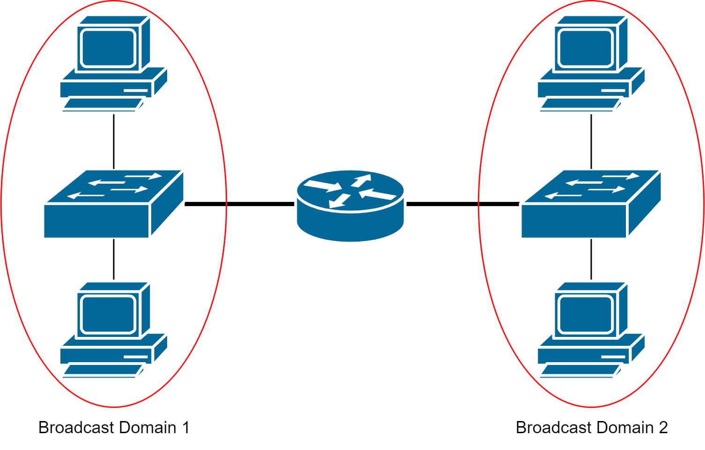

Configured switches for vLAN use however can limit the spread of broadcast to within the vLAN only. It really is as if its a different vLAN, just facilitated on the same switch.

#### Collision Domains
A collision domain is an area in the network where frames being sent can possibly collide and cause errors.

**Switches** and **routers** divide up collision domains as they smartly control the flow of data. **Hubs** however do nto have any sort of logic, and pass data around everywhere, it **expands** the collision domain.

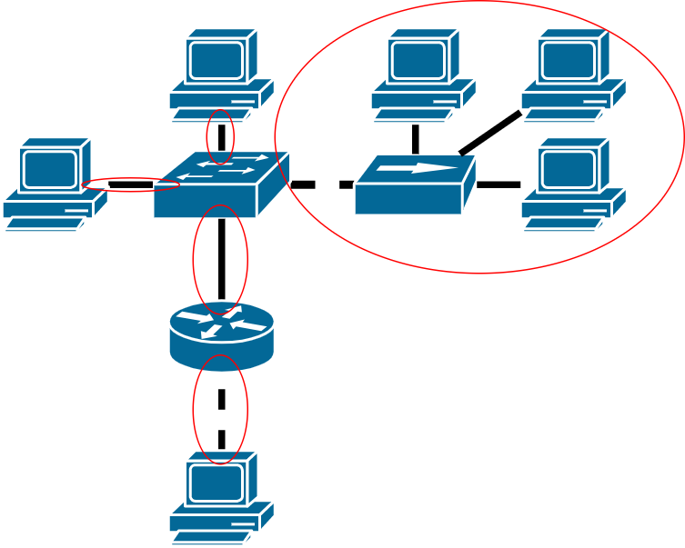

### vLAN Tagging 
The standard Ethernet frame header does not contain information about the VLAN to which the frame belongs

To distinguish where a frame comes from among the vLANs, a **tag** is inserted into the frame header. This process is called tagging, it is accomplished by using the IEEE 802.1Q header standard.

|          Standard Ethernet           |          IEEE 802.1Q header           |
| :----------------------------------: | :-----------------------------------: |
| 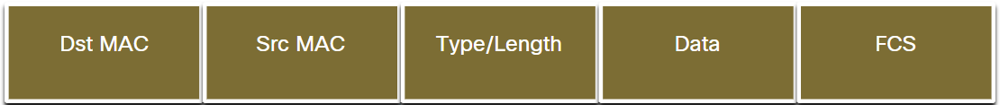 | 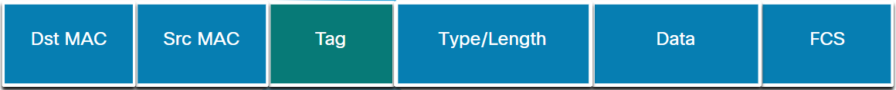 |

#### 802.1Q standard

The following fields are present in a tag
- **Type** - A 2-byte value called the tag protocol ID (TPID) value. For Ethernet, it is set to hexadecimal 0x8100.
- **User priority** - A 3-bit value that supports level or service implementation.
- **Canonical Format Identifier (CFI)** - A 1-bit identifier that enables Token Ring frames to be carried across Ethernet links.
- **VLAN ID (VID)** - A 12-bit VLAN identification number that supports up to 4096 VLAN IDs.

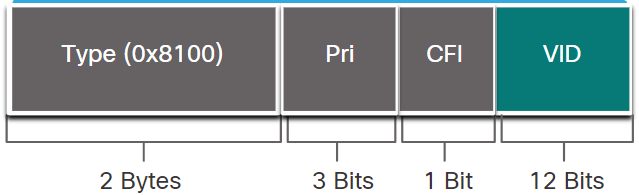

#### Access ports and Trunk ports
##### Purpose
Typically these tagged frames are sent over a trunk connection between switches. 

**Access** ports are regular ports that switches will receive frames to foward to as usual.

**Trunk** ports are ports where traffic from different vLANs are expected to traverse.

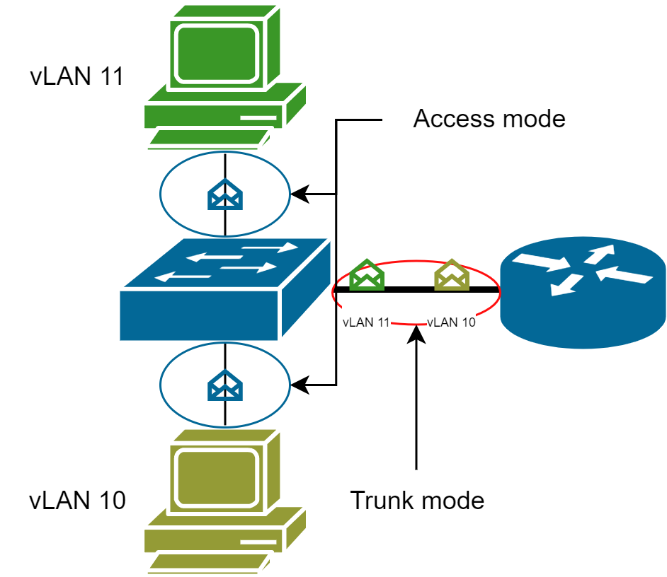

##### Dynamic trunking protocol
During configuration, you will find you can set the switch ports to not just **access** and **trunk**, but **dynamic auto** and **dynamic desirable**.

A Desirable mode switch will actively negotiate for trunk mode. The auto mode switch will go with anything its told. Trunk and access modes are static and having 2 switches with those different modes will result in a connection disruption.

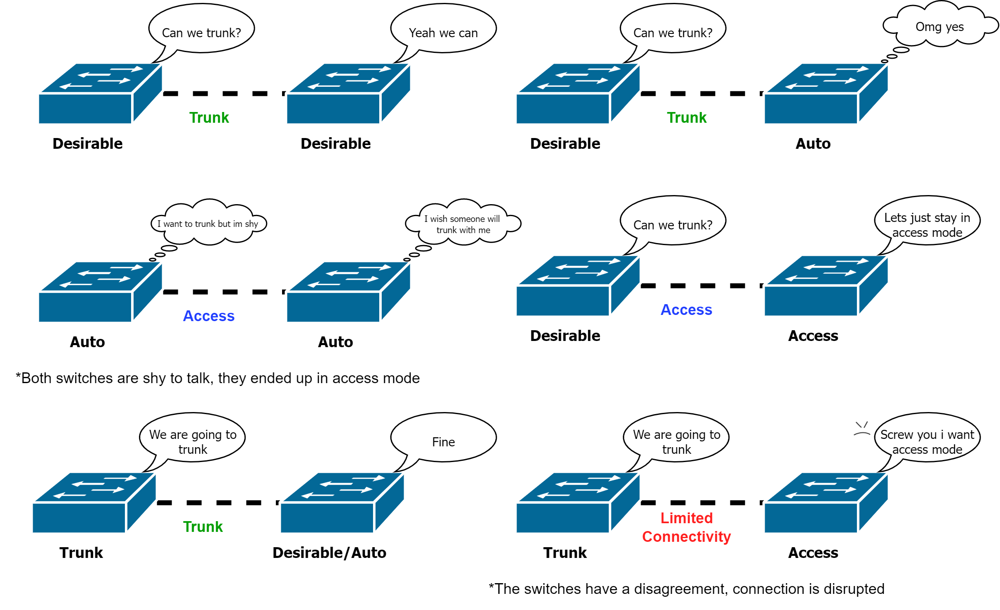

#### Native vLAN
Normally a native vLAN handles tagged frames to foward. But there are some situations that the 802.1Q protocol instructs to drop the frame.

##### Same VID on the native vLAN
Generally traffic sent to the native vLAN should not be tagged. If the VID of the frame is the same as the native vLAN, the frame will be dropped.

##### Untagged frames on the native vLAN
It is not unusual for the native vLAN to receive **untagged** frames.

When a trunk port receives untagged frames, it will foward it on the native vLAN. If there are no devices on the native vLAN and no other trunk ports on the vLAN, the frame is dropped.

#### Voice vLAN
//todo

## Inter-vLAN routing
vLANs are used to segment switched Layer 2 networks for a variety of reasons. But Layer 2 switches cant really foward packets to different vLANs for hosts.

A Layer 3 router is needed to route to different vLANs.

3 Inter-vLAN options are:
1. **Legacy inter-vLAN routing**, its legacy so no
2. **Router-on-a-stick**, good for small to medium networks
3. **Layer 3 Switch Virtual Interface(SVI)**, good for medium to large networks

##### Legacy inter-vLAN routing
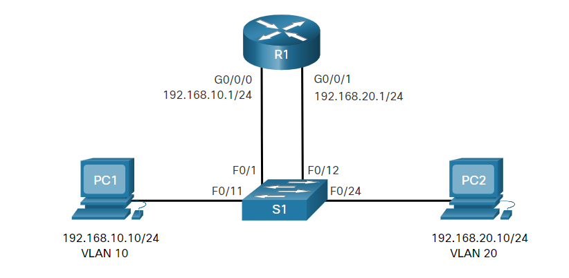
In this routing method, we literally stick multiple cables from the switch to the router. Each port of the router is for one vLAN.

The problem becomes obvious when we try to scale up, at some point we will run out of ports in the routers.
##### Router on a stick
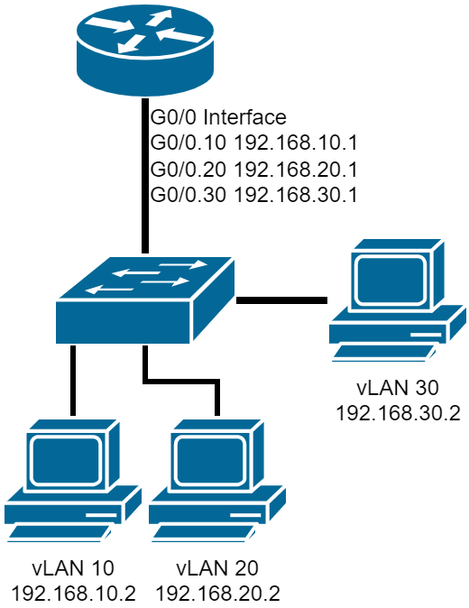

The ‘router-on-a-stick’ inter-VLAN routing method overcomes the limitation of the legacy inter-VLAN routing method. It only requires one physical Ethernet interface to route traffic between multiple VLANs on a network.

Routers have **sub-interfaces** in one port interface, it allows you to configure multiple IP Addresses for each of the sub-interface. Effectively, serving as many default gateways in just one port.
##### Layer 3 Switch SVI
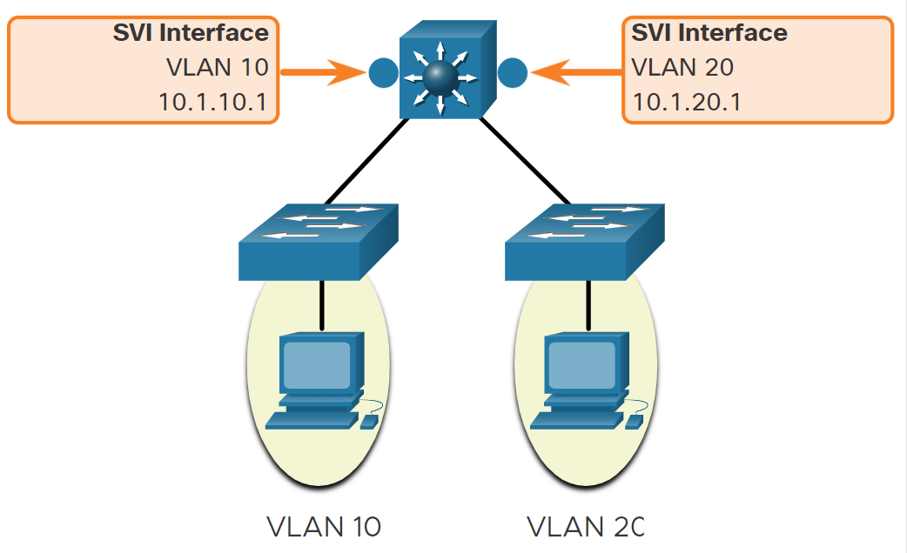
The modern method of performing inter-VLAN routing is to use Layer 3 switches and switched virtual interfaces (SVI). An SVI is a virtual interface that is configured on a Layer 3 switch, as shown in the figure.

Layer 3 Switches can be thought of as both a switch and a router. It shares many commands between switches and router.

## Spanning tree protocol

The Spanning Tree Protocol (STP) is a protocol that allows for redundancy in connections while preventing loops or cycles in a layer 2 topology.

The Spanning tree is recalculated whenever a link or switch goes down, or whenever a switch is added.

Per-VLAN Spanning Tree (PVST) versions of STP support an instance of STP for every vLAN. So many switches may have the role of root bridge in different vLANs.

### The STP algorithm
#### About Bridge ID (BUID)

Fun fact, Switches used to be otherwise known as **bridges**, hence the relation. 

Switches hav a BUID to communciate with each other, in the STP algorithm, the BUID is a method used to elect the **root bridge**

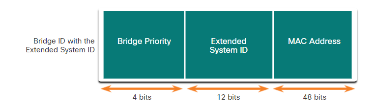

> Switches can exchange all this information through sending **Bridge Protocol Data Units (BPDUs)**.

##### Bridge prioority
This is the first number used to determine which switch becomes the root bridge. By default every switch starts off at **32768**. It can be changed anywhere from 0-61440 in increments of 4096 strictly. 

##### System ID
The extended system ID value is a decimal value added to the bridge priority value in the BID to identify the VLAN for this BPDU

##### MAC Address
Eventually when the priority and system ID cant tie break the root bridge, the unique MAC address is used.

The switch having the MAC address with the lowest value, expressed in hexadecimal will win rights to become root bridge.

#### Step 1: Elect the root bridge

The switches first have to decide a single switch to be the **root bridge**. It will be the reference point for path calculations when building the spanning tree.

The numbers they use to elect a root bridge follows below, from first to last resort:
1. Lowest Bridge priority + Sys ID
2. Lowest MAC Address

#### Step 2: Elect Ports
Once the root bridge has been elected. SWwitches do a spanning tree calculation to find out the best path to the root bridge.

##### Bandwidth path cost
|    Speed    | STP IEEE 802.1D | RSTP IEEE 802.1w |
| :---------: | :-------------: | :--------------: |
| **10 Gbps** |        2        |       2,000       |
| **1 Gbps**  |        4        |      20,000       |
|  100 Mbps   |       19        |      200,000      |
|   10 Mbps   |       100       |     2,000,000      |

*Though these ports have a default cost, it could also be configured*

##### Electing root port

The **root port** is a port of a switch that eventually leads to the root bridge, the port chosen as a root port is usually the one with the lowest cost.

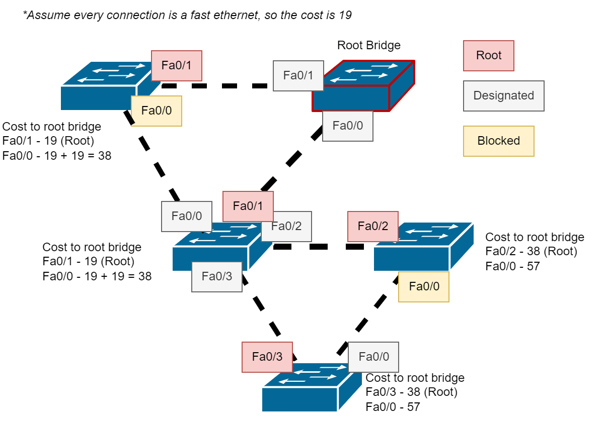

In the diagram above, the root ports always have a path closest to the Root bridge. Paths that attempt to detour through another switch incur a high cost and thus arent chosen and eventually blocked.

##### Electing designated ports
The **root bridge** will turn all of its ports into **designated mode**.

For other non-root switches, ports not going toward the root bridge are **designated**.
A pattern that thends to follow is that in a connection, if one side is **root**, it follows that the other is **designated**.

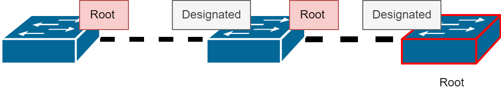

And for connections where both sides are **designated**, that means the path is redundant, eventually the switches wil decide systematically one side to be **alternate**  or **blocked**.

##### Electing blocked ports

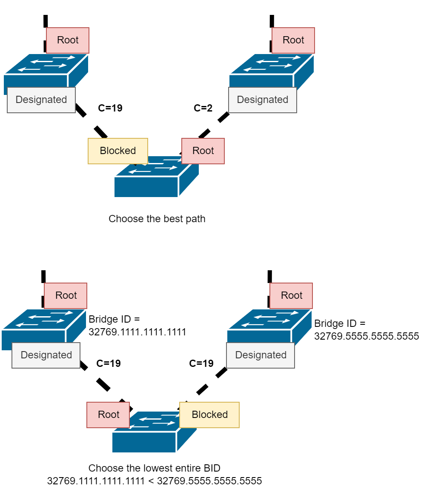
When a switch has 2 paths, it will block the port with the higher path cost.

But when the costs are the same, the entire **BID** is the tie breaker instead. The switch will choose the port conencting to a switch with a lower BID as the root port, the other one gets blocked.

> Note: When we say lowest BID, it is not different from comparing lowest Bridge priority and then Mac Address. The Bridge priority number is the most significant number, and so regardless of MAC, the lowest Bride priority will always have the lowest overall BID.
> 
##### Electing blocked ports among multiple connections

So what if a switch has more than one connection.

First, block the more expensive path.

If they are equal, block the higher sender port priority.

And finally, if all that is equal, just resort to blocking the higher port ID.

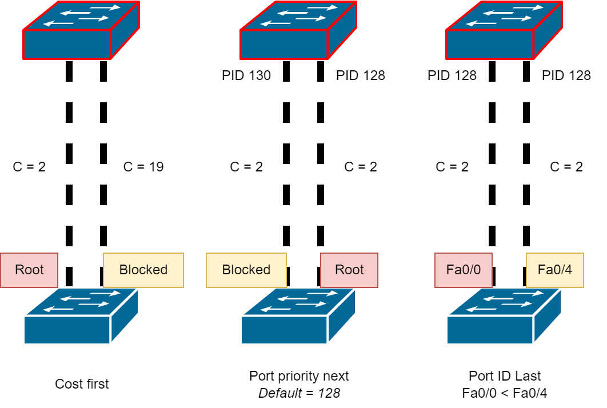

### STP timers and port states

Recall that STP will recalculate the spanning tree whenever changes to the topology are made.

There are several timers in STP that determine how quickly the protocol reacts to changes in the network topology. These timers include:

1. Hello Time: The hello time is the amount of time between two BPDUs (Bridge Protocol Data Units) being sent out on a port. By default, the hello time is 2 seconds. But i can be changed from 1 to 10.

2. Forward Delay: The forward delay is the amount of time that a port stays in the listening and learning states before moving into the forwarding state. By default, the forward delay is 15 seconds. But can be changed from 4 to 30.

3. Max Age: The max age is the amount of time that a switch will wait before changing the STP topology. By default, the max age is 20 seconds. Can be changed from 6 to 40.

That explains part of the phenomenon when you add switches in packet tracer and the connections are still down, only after a while they come back up.
> Note: These default times are changed from the root bridge, which dictates the value of these timers for the STP domain.
>
> So theres no need to configure the times for every switch.
>
> Also, to avoid problems with STP. IEEE encourages keeping the network within 7 switches in diamete when using default timers.

##### Port States

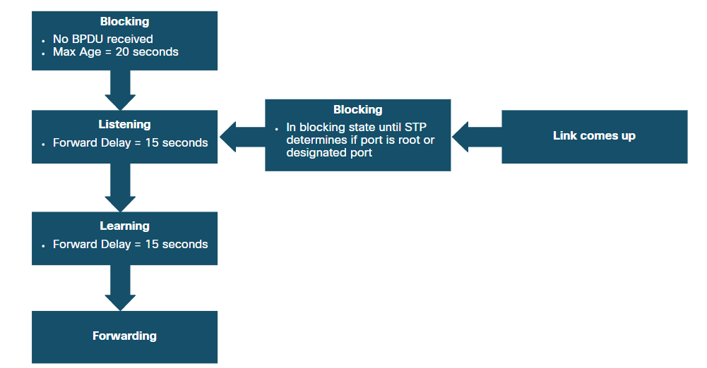

|   State   |                                                                                        Description                                                                                         |
| :-------: | :----------------------------------------------------------------------------------------------------------------------------------------------------------------------------------------: |
| Blocking  | The port is an alternate port and does not participate in frame forwarding. A Switch port uses the Max Age timer to wait for a BPDU, if it does not receive, it will go into blocking mode |
| Listening |                                                After blocking, the switch listens for BPDUs. It uses it to determine the path to the root.                                                 |
| Learning  |          After listening, the switch goes into learning mode. Here it processes the BPDUs and prepares to participate in fowarding. Here it also popualtes its MAC Address table.          |
| Fowarding | The switch port is finally ready to foward frames. It operates as normal here |

##### Status activity
|         State         |       BPDU       | MAC Table | Foward |
| :-------------------: | :--------------: | :-------: | :----: |
|       Blocking        |     Receive      |           |        |
|       Listening       | Receive and send |           |        |
|       Learning        | Receive and send | Updating  |        |
|       Fowarding       | Receive and send | Updating  |  Yes   |
| Administratively Down |                  |           |        |

### RSTP and other alternatives of STP
RSTP (IEEE 802.1w) is the new protocol to supercede IEEE 802.1D STP. It is also backwards compatible.

##### STP vs RSTP
|  Port modes   | Port Roles     |
| :-: | :-: |
| 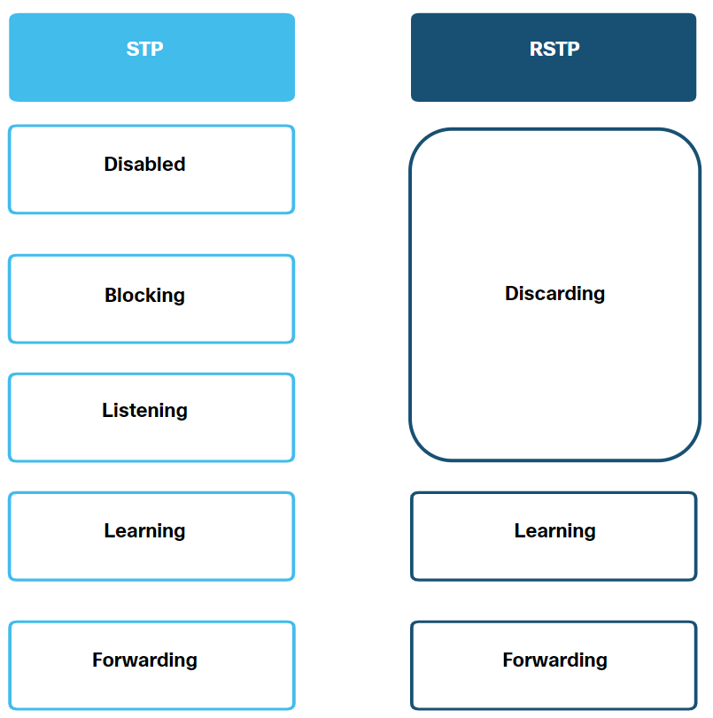 |     |
#### Portfast and BPDU Guard
Sometimes we have dedicated switch ports for end devices. It can be a pain to wait for the port to go online when you connect an end device.

**Portfast** removes the whole timer thingy, and the port immediately goes into fowarding mode. Not only that, it **will not send BPDUs**.
So keep a port in portfast mode only if its for end devices.

BPDU Guard mode will causes the port to become in an error state when receiving any BPDUs. By shutting down the port, we prevent loops, later an admin must manually fix it.

#### Alternatives to STP
//todo

## Etherchannel
### A Port Channel
EtherChannel is originally developed by Cisco as a way to group multiple redundant connections into a single **port channel**. This allows to make use of redundant connections where normally the STP would have blocked it to avoid bridge loops.

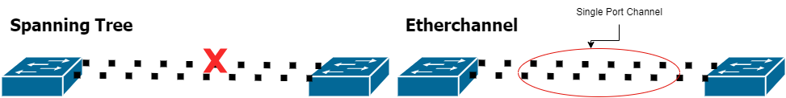

Since the port channel is treated as a regular link. When a link in the inner channel goes down, STP will not require recalculation as the other redundant links can still carry data.

#### Caviats
You **cannot** mix different port types together into a port channel. A port channel cannot have both Gigabit Ethernet and Fast Ethernet. The etherchannel can group 8 identical ports together.

Like trunking, the etherchannel on the other switch must be configured the same way. Same trunk mode, vlan, duplex, speed, etc.

#### LACP and PAgP Protocol
There are 2 protocols for switches to negotiate etherchannels. LACP and PAgP.

Switches using the LACP can have 3 modes:
- **On**: *Dont negotiate at all and assume LACP, otherside must be strictly on to establish*
- **Desirable**: *Initates negotiation and sends LACP packets*
- **Auto**: *Passively respond to LACP packets for negotiating*

Switches using the PAgP can have 3 modes:
- **On**: *Dont negotiate at all and assume PAgP, otherside must be strictly on to establish*
- **LACP active**   : *Initates negotiation and sends PAgP packets*
- **LACP passive**: *Passively respond to PAgP packets for negotiating*

> To explain in other words, the whole deal with Desirable and auto is a matter of deciding consent. They are similar to how trunking is negotiated with DTP. However oddly in here, when on switch is **on**, even if the other switch is in a passive or auto state, the channel will not be established. In DTP, one switch can be in trunking mode, and the other can be auto or desirable and trunking is established.
##### Protocol outcomes
**PAgP Modes**
| Switch 1  | Switch 2  | Channel establishment |
| :-------: | :-------: | :-------------------: |
|    On     |    On     |          Yes          |
|    On     | Desirable |          No           |
|    On     |   Auto    |          No           |
| Desirable | Desirable |          Yes          |
| Desirable |   Auto    |          Yes          |
|   Auto    | Desirable |          Yes          |
|   Auto    |   Auto    |          No           |

**LACP Modes**
| Switch 1 | Switch 2 | Channel establishment |
| :------: | :------: | :-------------------: |
|    On    |    On    |          Yes          |
|    On    | Passive  |          No           |
|    On    |  Active  |          No           |
|  Active  |  Active  |          Yes          |
|  Active  | Passive  |          Yes          |
| Passive  |  Active  |          Yes          |
| Passive  | Passive  |          No           |

> LACP and PAgP behave identically.

## First Hop Redundancy Protocol //todo

## Internet Security
### Common Types of Cyberattacks
#### Distributed Denial of Service
Distributed Denial of Service (DDoS) or Denial of Service (DoS) are types of attacks with the goal of effectively shutting down a computer by spamming it with too many requests that it cannot serve other legitimate users.

An example scenario is a game server, when the game server undergoes a DoS cyberattack, it takes much longer to process every player, and on your side as the player, you experience unplayable latency.

#### Data Breaches
These attacks involve compromising servers or computers with the goal of stealing data.

#### Malware
Malware is a term used to refer to any malicious software that destroys computers, controls computers, steals data, annoy people or any other malicious activity.

Common malware types include:
  - Keyloggers: Software that tracks the keys you pressed without your knowledge
  - Virus: Code that works by making other executables infected Eg: Malicious .dll
  - Trojan Horse: A seemingly harmless app that tries to introduce a backdoor for other malware payloads.
  - Cryptoware: Software that encrypts all your data
  - Ransomware: Cryptoware that offers to decrypt your data back to normal for ransom money or some other ransom.
  - Adware: Software that just stays on your computer to show advertisements.
  - Rootkits: Malware that sits together with the other core operating system files, making it tricky to remove.
  - Worm: Malware that automatically replicates itself and sends to other computers it can reach from your network, it can do so by exploiting vulnerabilities in apps or operating systems.
  - Botnet: A software that gains control over your computer, often used by hackers to facilitate a DDoS attack.
  - Malicious Macros: Sneak malware that hides inside documents as malicious macros. (You can get hacked by opening a shady word document!)

### Endpoint security

### LAN Attacks
#### MAC Table flooding

#### DHCP Attacks
##### DHCP Starvation
A type of DoS that shutsdown a network for new clients by taking all the leasable IP addresses. Usually a rogue computer sends many **DHCP DISCOVER** messages with fake Mac Addresses. The DHCP server will serve those discover requests and eventually run out of ip addresses to lease out to legit users.

##### DHCP Spoofing
A computer connects to the network acting as a rogue DHCP server. The computer can provide false DHCP information favourable to the hacker. These include:
- A false default gateway, you can effectively do a man-in-the-middle-attack by forcing devices to go through your router to intercept or steal the data.
- False DNS server, you can also point other devices to your own fake DNS server.
- Invalid IP address, you can also effectively perform a DoS by giving an invalid IP address to a pc, it will not be able to participate in the network.

### STP Attack

### DTP Spoofing

You have reached the end
