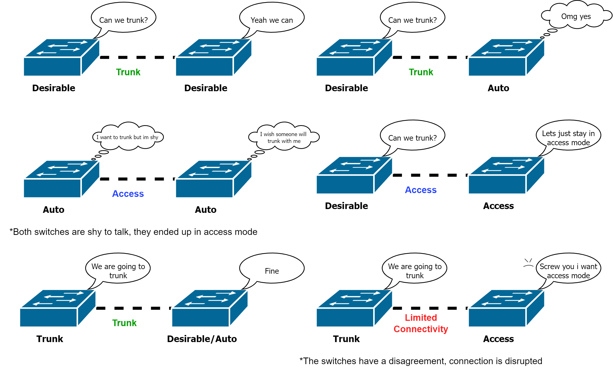

<link rel="stylesheet" href="../Resources/styles/base.css">

<!---This is for enabling LaTeX rendering in exports--->
<!---                  Do not remove                --->

<script type="text/javascript" src="http://cdn.mathjax.org/mathjax/latest/MathJax.js?config=TeX-AMS-MML_HTMLorMML"> 
</script>

<script type="text/x-mathjax-config">
MathJax.Hub.Config({ tex2jax: {inlineMath: [['$','$']]}, messageStyle: "none" });
</script>


# Cisco Internetwork Operating System Command list

Get the latest version of the note [here](https://github.com/Quuton/Markdown-Notes)

- [Cisco Internetwork Operating System Command list](#cisco-internetwork-operating-system-command-list)
  - [Basic IOS operations](#basic-ios-operations)
    - [Entering privilege mode](#entering-privilege-mode)
    - [Entering configuration mode](#entering-configuration-mode)
    - [Saving the configuration](#saving-the-configuration)
    - [Deleting configurations](#deleting-configurations)
    - [Restarting the device](#restarting-the-device)
    - [Referencing multiple interfaces](#referencing-multiple-interfaces)
  - [Basic IOS diagnostics](#basic-ios-diagnostics)
    - [Show the MAC Table](#show-the-mac-table)
    - [Show the ARP Table](#show-the-arp-table)
    - [Show the IP Configurations on the ports](#show-the-ip-configurations-on-the-ports)
    - [Show the vLAN configurations](#show-the-vlan-configurations)
    - [Show all configurations](#show-all-configurations)
  - [Basic IOS configurations](#basic-ios-configurations)
    - [Setting a hostname](#setting-a-hostname)
    - [Setting a message of the day](#setting-a-message-of-the-day)
    - [Basic password authentication](#basic-password-authentication)
      - [User mode password](#user-mode-password)
      - [Privilege mode password](#privilege-mode-password)
      - [Encrypting passwords](#encrypting-passwords)
    - [Setting up SSH](#setting-up-ssh)
      - [Adding a domain name](#adding-a-domain-name)
      - [Generating RSA key pairs](#generating-rsa-key-pairs)
      - [Configure a user account](#configure-a-user-account)
      - [Configure vty lines to use SSH](#configure-vty-lines-to-use-ssh)
      - [Changing SSH version](#changing-ssh-version)
    - [Toggling interfaces](#toggling-interfaces)
  - [Cisco Layer-2 switch commands](#cisco-layer-2-switch-commands)
    - [Exclusive diagnostics //TODO](#exclusive-diagnostics-todo)
    - [Configuring duplex mode](#configuring-duplex-mode)
    - [Creating and Renaming vLANs](#creating-and-renaming-vlans)
      - [Creating vLANs](#creating-vlans)
      - [Enabling auto-mdix](#enabling-auto-mdix)
      - [Configuring the switch virtual interface address](#configuring-the-switch-virtual-interface-address)
      - [Toggling the vLAN](#toggling-the-vlan)
      - [Configuring Data and Voice vLAN](#configuring-data-and-voice-vlan)
    - [Configuring trunking](#configuring-trunking)
      - [Configuring many ports at once](#configuring-many-ports-at-once)
      - [Access and Trunk mode](#access-and-trunk-mode)
    - [Dynamic trunking protocol](#dynamic-trunking-protocol)
      - [Switch consent](#switch-consent)
      - [Configuring DTP mode](#configuring-dtp-mode)
      - [Disabling DTP](#disabling-dtp)
      - [Assigning vLANs to ports](#assigning-vlans-to-ports)
        - [Single vlan assignments](#single-vlan-assignments)
        - [Allowing vLANs to pass through the trunk](#allowing-vlans-to-pass-through-the-trunk)
    - [Configuring the spanning tree protocol](#configuring-the-spanning-tree-protocol)
      - [About the STP](#about-the-stp)
      - [Show the spanning tree configuration](#show-the-spanning-tree-configuration)
      - [Enable or disable the STP](#enable-or-disable-the-stp)
      - [Configuring priority manually](#configuring-priority-manually)
      - [Primary and secondary root bridges](#primary-and-secondary-root-bridges)
      - [Enabling portfast](#enabling-portfast)
      - [Enabling BPDU guard](#enabling-bpdu-guard)
    - [Configuring an EtherChannel](#configuring-an-etherchannel)
      - [Grouping interfaces into a port channel with LACP](#grouping-interfaces-into-a-port-channel-with-lacp)
      - [Configuring a port channel](#configuring-a-port-channel)
      - [Configuring multi-vLAN trunk](#configuring-multi-vlan-trunk)
    - [Assigning a default gateway to the switch](#assigning-a-default-gateway-to-the-switch)
  - [Cisco Layer-3 router commands](#cisco-layer-3-router-commands)
    - [Configuring port addresses](#configuring-port-addresses)
    - [Static routing](#static-routing)
      - [About](#about)
      - [Designating next-hop addresses](#designating-next-hop-addresses)
    - [Inter-vLAN routing](#inter-vlan-routing)
      - [Configuring sub-interfaces](#configuring-sub-interfaces)
      - [Enable 802.1Q inter-vLAN routing](#enable-8021q-inter-vlan-routing)
    - [Setting up HSRP](#setting-up-hsrp)
      - [Choosing the HSRP version](#choosing-the-hsrp-version)
      - [Configuring the virtual HSRP group](#configuring-the-virtual-hsrp-group)
      - [Designating the Active Router](#designating-the-active-router)
      - [Preemptively reassume original role](#preemptively-reassume-original-role)


## Basic IOS operations
### Entering privilege mode
Most cisco device operations requires the user to be in priveleged mode, especially configurations to the device.
To enter this mode, use `enter`
```
Switch> enable
Switch#
```
### Entering configuration mode
To make any configurations to the cisco device, you have to enter config mode using `configure` in privilege mode.
```
Router# configure
```
From there on, a prompt will be shown asking for which location to configure, typically we simply put in `terminal`.

A faster way to start configuring cisco devices:
```
Router# configure terminal
```
The prompt will be avoided.

### Saving the configuration


There are two types of configurations, the **running** config and the **startup** config, as their name implies, one is temporary.

**ANY CONFIGURATIONS YOU MADE ARE STORED IN THE RUNNING CONFIG**, it will erase on shutdown of the device.

You can copy a configuration using the `copy` function.
```
Router# copy running-config startup-config
```
This example copied `running-config` onto `startup-config`, this is also how you effectively **save configurations**. If you need to, you can do it in the other way around.

### Deleting configurations
Similar to copying a configuration, simply call the `erase` function and the configuration you want to remove.
```
Router# erase startup-config
```

### Restarting the device

Calling `reload` will force the router to restart. The running configuration will be lost in the process, so this is one way to test a configuration and get rid of it if you don't like it.
```
Switch# reload
```
### Referencing multiple interfaces
In most cases, you need to configure interfaces in batches. Normally we configure individiual interfaces like so:
```
Router(config)# interface FastEthernet0/0
```
But using the `range` keyword, we can specify the batch.
```
Router(config)# interface range fastEthernet0/0-4
```
You can also specify multiple batches using `,` as the seperator
```
Router(config)# interface range FastEthernet0/0-4, GigabitEthernet0/0-2
```

## Basic IOS diagnostics
### Show the MAC Table
```
Switch# show mac address-table
```
### Show the ARP Table
```
Switch# show arp
```
### Show the IP Configurations on the ports
```
Router# show ip interface brief
```
### Show the vLAN configurations
```
Switch# show vlan brief
```

### Show all configurations
```
Switch# show running-config
```

## Basic IOS configurations

### Setting a hostname

The hostname of a cisco device can be changed with the `hostname` function. Simply provide the new hostname as an argument.
```
Switch(config)# hostname SampleName-1
```
As far as guidelines go, let the name start with a letter, don't contain spaces or wacky symbols and keep it below 64 chars.

### Setting a message of the day
You can set a message by using the `banner` function, pass in the `motd` keyword and the message enclosed in '#' symbols to signify start and stop. It is important to warn visitors that only authorized members are allowed to access.

```
Switch(config)# banner motd #Message of the day#
```

> The reason it is important to make it clear unauthorized users are not allowed is because there was one case where a hacker exploited a loophole in the legal system by claiming the company he hacked never explicitly mentioned he was unwelcome, therefore he claimed he was welcomed in.

### Basic password authentication
Do note that there are 2 passwords, the `password` for **user** mode and `secret` for **privilege** mode.

#### User mode password

You need to configure the password for each line access method using the `password` function.

This is an example for configuring the **console** cable connections:
```
Switch(config)# line console 0
Switch(config-line)# password UserPassword
Switch(config-line)# login
Switch(config-line)# end
```
Computer now connecting via the rollover cable need to input a password to access the terminal.
> For direct **console** connections, there is usually only one port available, so we call **line console 0**. For remote connections through telnet or ssh, we usually instead call **line vty 0 15**. 
>```
>Switch# configure terminal
>Switch(config)# line vty 0 15
>Switch(config-line)# password UserPassword
>Switch(config-line)# login
>Switch(config-line)# end
>```
> In this case, the **vty** is numbered from 0 to 15. This is because most cisco switches can have **16 users for remote connections**. Make sure you check with your manual to find out the number.

#### Privilege mode password

This password is more important as it gives you privilege to edit the configurations of the router.
```
Router(config)# enable secret SuperPassword
```
#### Encrypting passwords
This is a function invokable in **global config mode**

Passwords created are usually stored in plaintext. Wow.

You can invoke `service password-encryption` to encrypt them:
```
Router(config)# service password-encryption
```

### Setting up SSH
The default connection type for devices is the insecure **telnet**, everything sent over the internet is in plaintext. Preferrably remote management should be done in encrypted **SSH**.

First make sure the hostname has been configured because the default name cannot be used, read more [here](#setting-a-hostname).

#### Adding a domain name
```
myRouter(config)# ip domain-name cisco.com
```

#### Generating RSA key pairs
When generating the key pairs, the prompt will usually ask for the length of the modulus. While the default is 512, a higher number is more secure, but also takes longer to create and use. 1024 is a popular number.
```
myRouter(config)# crypto key generate rsa
How many bits in the modulus [512]: 1024
```

#### Configure a user account
Start by specifying a username after the `username` keyword, in this case its **admin**, then the password after the `secret` keyword, in this example is **ccna**.
```
myRouter(config)# username admin secret ccna
```
#### Configure vty lines to use SSH
Because telnet is insecure, we want to make sure vty connections use SSH instead of telnet
```
myRouter(config)# line vty 0 15
myRouter(config-line)# transport input ssh
myRouter(config-line)# login local
myRouter(config-line)# exit
```
> `login local` is used instead of `login` to compare the new username created for SSH.
#### Changing SSH version
By default, SSH is usually set in version 1.99. Optionally you can change it to version 2.00
```
myRouter(config)# ip ssh version 2
``` 
### Toggling interfaces
Most interfaces in cisco devices can be turned on and off using the `shutdown` keyword.

To keep an interface open:
```
Switch(config-if)# no shutdown
```

To turn the interface off:
```
Router(config-if)# shutdown
```

## Cisco Layer-2 switch commands
### Exclusive diagnostics //TODO
```
Switch# show interfaces | include Ethernet
```

```
Switch# show interface status
```
Show information about the trunked ports.
```
Switch# show interfaces trunk
```

### Configuring duplex mode
To configure the operational duplex mode, first choose a port to configure, then using `duplex` keyword specify either `half` or `full`.

Then you can use the `speed` keyword to configure the speed for that port in **Mbps**
```
Switch(config-if)# duplex full
Switch(config-if)# speed 100
```
### Creating and Renaming vLANs
#### Creating vLANs
vLANs are actually all created already, they simply lack a name and thus appear invisible. **vLAN 1** however is the exception, it is the default vLAN and cannot be removed.
```
Switch(config)# vlan 50
Switch(config-if)# name myVLAN
```

#### Enabling auto-mdix
Auto-mdix is used to avoid the need to worry about a straight-through or crossover cable.


#### Configuring the switch virtual interface address
You may need to assign an ip address in order to remotely control the switch. Choose the native vlan and assign an ip address.
```
Switch(config)# interface vlan 50
Switch(config-if)# ip address 192.168.0.1 255.255.255.0
```
> Do keep in mind there is a very big difference between invoking `vlan 50` and `interface vlan 50`. Generally jsut invoking `vlan` is to configure its name, invoking `interface vlan 50` allows you to configure the logical address instead.
#### Toggling the vLAN
To keep it open:
```
Switch(config-if)# no shutdown
```

To turn the vLAN off:
```
Switch(config-if)# shutdown
```

#### Configuring Data and Voice vLAN


### Configuring trunking
#### Configuring many ports at once
This can be done using `range`, read more  [here](#configuring-multiple-interfaces).
```
Switch(config)# interface range FastEthernet0/1, FastEthernet0/15
```
#### Access and Trunk mode
To put a port in access mode, where each port serves one device and will foward frames to another vlan, use the `access` keyword. Then you can assign a vlan number to isolate those devices.
```
Switch(config-if)# switchport mode access
Switch(config-if)# switchport access vlan 30
```
But if a single port is expected to foward frames from multiple devices in a vLAN or vLANs, use the `trunk` mode instead. You will need to reserve one vLAN for native mode, the other device on the other end must also have the same vLAN.
```
Switch(config-if)# switchport mode trunk
Switch(config-if)# switchport trunk native vlan 88
```

### Dynamic trunking protocol
#### Switch consent

In general, the desirable switch will actively negotiate for trunk mode. The auto switch will go with anything. Trunk and access modes are static and having 2 switches with those modes will result in connection disruption.
#### Configuring DTP mode
Auto DTP mode, the link is alright with becoming a trunk. 
```
Switch(config-if)# switchport mode dynamic auto
```

Desirable DTP mode, the link actively tries to make it a trunk.
```
Switch(config-if)# switchport mode dynamic desirable
```

#### Disabling DTP
To disable DTP, set the port back to access or trunk mode.

Then use `nonegotiate` to avoid DTP negotiation.
```
Switch(config-if)# switchport mode trunk
Switch(config-if)# switchport nonegotiate
```

#### Assigning vLANs to ports
##### Single vlan assignments
For access ports, it is done using the `access` keyword
```
Switch(config-if)# switchport access vlan 50
```
For trunk ports.
```
Switch(config-if)# switchport trunk vlan 50
```
For native trunk ports, you need the `native` keyword.
```
Switch(config-if)# switchport trunk native vlan 50
```
##### Allowing vLANs to pass through the trunk
```
Switch(config-if)# switchport mode trunk
Switch(config-if)# switchport trunk native vlan 99
Switch(config-if)# switchport trunk allowed vlan 10,20,30,99
```
### Configuring the spanning tree protocol
#### About the STP
The Spanning Tree Protocol (STP) is a protocol used to prevent endlessly travelling **frames**. This occurs in networks that have many redundant connections and a **cycle** or **loop** between switches in the network is made.


One nightmare that can spawn is a broadcast storm. Imagine if a switch fowards a broadcast, after fowarding it, the other switches foward the same frame again endlessly. Unlike IPv4 or IPv6, there is no Time to Live or Hop Limit, the switches will never know when to drop the frame.

However the solution shouldn't be to remove redundancy, because redundancy allows a network to keep operating even if failures occur.

#### Show the spanning tree configuration
You can use this command to know the status of each port and the status of the switch itself.
```
Switch# show spanning-tree vlan 1
```
#### Enable or disable the STP
By default, every switch port is configured to calculate a spanning tree. For some reason if you need it off, you can use the command below.
```
Switch(config)# no spanning-tree vlan 1
```
To turn it back on, simply call the `spanning-tree` function again.
```
Switch(config)# spanning-tree vlan 1
```

#### Configuring priority manually
By default, all switches are configured with their priority value at 32768. This number is important for switches to figure out which switch needs to be the root bridge.

If you otherwise want to manually elect a switch as a root, you can use `priority`.

```
Switch(config)# spanning-tree vlan 1 priority 4096
```


> The value for priority must be a multiple of **4096**, the lower the value, the more prioritized the switch is to take the role of a root bridge.
> 
#### Primary and secondary root bridges
You can also use the `root` keyword instead of manually putting in a priority value.

To set a switch as the **primary** root bridge,
```
Switch(config)# spanning-tree vlan 1 root primary
```

This sets the priority value to 24576.

To set a switch as a **secondary** or backup root bridge,

```
Switch(config)# spanning-tree vlan 1 root secondary
```

#### Enabling portfast
```
Switch(config-if)# spanning-tree portfast
```
#### Enabling BPDU guard
```
Switch(config-if)# spanning-tree bpduguard enable
```
### Configuring an EtherChannel
#### Grouping interfaces into a port channel with LACP
To group interfaces into one port channel, first go into config mode for the interfaces using `range`.
```
Switch(config)# interface range FastEthernet 0/1 - 2
```
Then create a new port channel and specify the LACP mode. Which can be `active`, `passive`, or `on`.

```
Switch(config-if-range)# channel-group 1 mode active
Switch(config-if-range)# exit
```
#### Configuring a port channel
You cna configure the port-channel in a similar fashion to other interfaces using `interface`. 
```
Switch(config)# interface port-channel 1
```

#### Configuring multi-vLAN trunk
```
Switch(config-if)# switchport mode trunk
Switch(config-if)# switchport trunk allowed vlan 1,2,20
```
### Assigning a default gateway to the switch
Swithes still need a default-gateway to be able to be controlled remotely.
```
Switch(config)# ip default-gateway 192.168.0.1
```

## Cisco Layer-3 router commands

### Configuring port addresses
Routers have the important job of acting as the default gateway for devices in a network to route the packets to remote networks. Computers need to know the ip address of the router's ports in order to establish a default gateway.

First choose a port to configure, then simply add the ip address and make sure the interface is not off.
```
Router(config)# interface GigabitEthernet0/1
Router(config-if)# ip Sddresswitch92.168.0.1 255.255.255.0
Router(config-if)# no shutdown
```
### Static routing
#### About
To set a static route, you need to reference a remote network and the expected port it will come from. 


Take the above scenario as an example, if we want PC 0 and PC 1 to be able to communicate, both Router and R2 must be configured to have static routing.

The `ip-route` command has the parameters:
- *[Remote network address]*
- *[Remote subnet]*
- *[Outcoming router port address]*

#### Designating next-hop addresses
```
Router(config)# ip route 192.168.3.0 255.255.255.0 192.168.2.2
```
The command above tells Router that it can expect packets from the **remote** 192.168.3.0 network to come from the 192.168.2.2 port of R2.

Likewise, in R2, we need to use
```
R2(config)# ip route 192.168.1.0 255.255.255.0 192.168.2.1
```
> It is quite counter-intuitive, normally you would expect the router to find out which networks the packets are coming from and what port to foward it to. 
### Inter-vLAN routing
#### Configuring sub-interfaces
Ports in a router that is expected to handle traffic from multiple vLANs can be configured as sub-interface. Simply add a `.` followed by the number to the interface port number. Usually the sub-interface number is kept the same as the vLAN number from the switches to keep things neat. In this case, it is `.10`
```
Router(config)# interface GigabitEthernet0/1.10
```
#### Enable 802.1Q inter-vLAN routing
After choosing a subinterface to configure, simply invoke the command to enable inter-vLAN routing via the 802.1Q protocol followed by the number.
```
Router(config-subif)# encapsulation dot1Q 10
```
If you are to configure the port to accept trunk lines from switches as well, you would need the `native` keyword.
```
Router(config)# interface GigabitEthernet0/1.88
Router(config-subif)# encapsulation dot1Q 88 native
```

> Sub-interfaces still need to be configured with an ip address
> ```
> Router(config-subif)# ip address 192.168.0.1 255.255.255.0
>```
> Computers coming from different vLAN may have traffic sent to one port in the router, but they can use different addresses.
>
> Not only that, you must enable the entire interface for the sub interfaces to work
> ```
>Router(config)# int GigabitEthernet0/1
> Router(config-if)# no shut
> ```

### Setting up HSRP
#### Choosing the HSRP version
First you need to choose an interface to configure HSRP for. Then you need to specify the version of HSRP. At the time of writing, the latest HSRP version is 2.

> HSRP V1 only supports IPv4 addressing
```
R1(config)# Interface GigabitEthernet0/0
R1(config-if)# Standby Version 2
```
#### Configuring the virtual HSRP group
Then you need to provide a **group number** followed by an **IP address**.

The interfaces of routers that intend to belong to the same group must have the same configuration.
```
R1(config-if)# Standby Version 1 192.168.1.1
```

#### Designating the Active Router
Now that you have chosen a few routers to serve as redundant backup. We should also choose which router will actively serve for now.

The default priority value is 100. A higher value will determine which router is the active router. If the priorities of the routers in the HSRP group are the same, then the router with the highest configured IP address will become the active router.

```
R1(config-if)# Standby 1 priority 100
```

#### Preemptively reassume original role
You can also configure the router to take back its original active role when it becomes operational once more.
```
R1(config-if)# standby 1 preempt
```


<p style="text-align:center;font-weight:bold;font-size:20px;">You have reached the end</p>


