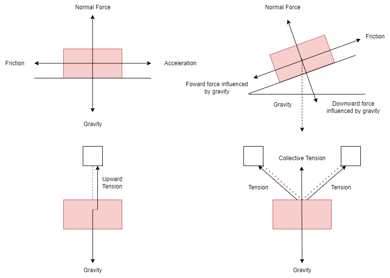

<link rel="stylesheet" href="../Resources/styles/base.css">
<!---This is for enabling LaTeX rendering in exports--->
<!---                  Do not remove                --->

# College Physics 
- [College Physics](#college-physics)
  - [Basic Kinematics](#basic-kinematics)
    - [Distance, speed and acceleration](#distance-speed-and-acceleration)
    - [Relationship between the measurements](#relationship-between-the-measurements)
      - [Displacement](#displacement)
      - [Velocity](#velocity)
      - [Acceleration](#acceleration)
  - [Uniform acceleration](#uniform-acceleration)
    - [Uniform kinematics](#uniform-kinematics)
    - [Falling in earth's gravity](#falling-in-earths-gravity)
  - [Projectile motion](#projectile-motion)
    - [Motion Equations](#motion-equations)
    - [Trajectory](#trajectory)
    - [Horizontal Range $R$](#horizontal-range-r)
  - [Circular motion](#circular-motion)
    - [Circular velocity](#circular-velocity)
    - [Period](#period)
    - [Centripetal force](#centripetal-force)
  - [Newton's motions](#newtons-motions)
    - [Mass and force](#mass-and-force)
    - [Equilibrium](#equilibrium)
    - [The acting forces](#the-acting-forces)
        - [Object on flat ground](#object-on-flat-ground)
        - [Object on incline](#object-on-incline)
        - [Object suspended by single rope](#object-suspended-by-single-rope)
        - [Object suspended by multiple ropes](#object-suspended-by-multiple-ropes)
      - [Coefficient of Friction](#coefficient-of-friction)
    - [Tension and pulleys](#tension-and-pulleys)
  - [Gravitational force](#gravitational-force)
  - [Energy and Power](#energy-and-power)
    - [Work Done](#work-done)
    - [Mechanical energy](#mechanical-energy)
        - [Instantaneous Kinetic Energy](#instantaneous-kinetic-energy)
        - [Gravitational Potential Energy](#gravitational-potential-energy)
      - [Conservation of energy](#conservation-of-energy)
    - [Work Done Theorem](#work-done-theorem)
        - [Work Done from difference in kinetic energy](#work-done-from-difference-in-kinetic-energy)
        - [Work Done in falling object](#work-done-in-falling-object)
    - [Rate of energy](#rate-of-energy)
      - [Power](#power)
  - [Recommended Units for calculating](#recommended-units-for-calculating)

## Basic Kinematics
### Distance, speed and acceleration

In kinematics, the basic measurements we can know are **distance**, **speed** and **acceleration**. And their vector counterparts **displacement**, **veloocity** and **acceleration**.

**Distance** is simply how much an object has moved in any direction, **displacement** or **position** is how far an object is away from the origin. It is represented as $d$ or alternatively $x - x_0$ or $\Delta{x}$

**Speed** is the rate of change of distance over time, **velocity** is speed with direction (negative means going the other way around). It is represented as $v$

Finally, **acceleration** is the rate of change of **velocity**, if its negative it means the object is either slowing down or speeding up the other way.

### Relationship between the measurements
#### Displacement
**Displacement** from constant velocity:
$$\Delta{x} = d = vt$$

**Instantaneous Displacement** from velocity function:
$$\Delta{x} = d = \int_{t_0}^{t} v dt$$

#### Velocity
**Velocity** from constant acceleration:
$$v = v_0 + at$$

**Average Velocity**:
$$v_{avg} = \dfrac{\Delta{x}}{\Delta{t}}$$ 

**Average Velocity** from 2 velocities:
$$v_{avg} = \dfrac{v_0 + v}{2}$$

**Instantaneous velocity** from given displacement function:
$$v = \dfrac{dx}{dt}$$

**Instantaneous velocity** from given acceleration function:
$$v = \int_{t_0}^{t}a dt$$

#### Acceleration
**Instantaneous Acceleration** from given displacement equation:
$$a = \dfrac{d^2x}{dt^2}$$
**Instantaneous Acceleration** from given velocity equation:
$$a = \dfrac{dv}{dt}$$
**Average acceleration** from velocities:
$$a_{avg} = \dfrac{dv}{dt}$$

## Uniform acceleration
### Uniform kinematics
The equations below only apply if we know the acceleration does not change.

Likely, you will find yourself missing 2 variables, one which you need to find. To find that, select the equation with a missing quantity you do not need to find yet.

**Velocity accelerating constantly**. *Missing quantity: $\Delta{x}$*
$$v = v_0 + at$$

**Displacement between 2 instant velocities**. *Missing quantity: $a$*
$$x - x_0 = \dfrac{v_0 + v}{2}t$$

**Displacement of the initial velocity accelerating**. *Missing quantity: $v$*

$$x - x_0 = v_{0}t + \dfrac{1}{2}at^2$$

**Displacement using a final accelerated velocity**. *Missing quantity: $v_0$*

$$x - x_0 = vt - \dfrac{1}{2}at^2$$

**Square of final velocity from initial squared velocity and acceleration and distance**. *Missing quantity: $t$*
$$v^2 = v_{0}^{2} + 2a(\Delta{x})$$

### Falling in earth's gravity
As an object falls on earth, there is an accelration caused by gravity:
$$ a = -g = -9.8 m/s$$

When an object is air with a given velocity, we can assume its velocity to be -9.8 m/s.

Additionally, the typical turning point where the object starts to fall after having been launched up into the air can be found when the velocity is 0.

## Projectile motion  

In projectile kinematics, we need to assume the horizontal and vertical motion of the particle seperately.

Here, $\theta_0$ represents the launch angle or the landing angle

### Motion Equations
**Horizontal displacement due to velocity**
$$\Delta{x} = (v_0cos{\theta_0})t$$
**Vertical displacement due to velocity and gravity**
$$y_1 - y_0 = \Delta{y} = (v_0sin{\theta_0})t - \dfrac{1}{2}gt^2$$

**Vertical velocity influenced by gravity**
$$v_y = v_0 sin{\theta_0} - gt$$
**Vertical velocity calculated from vertical displacement**
$$v_y^2 = (v_0 sin{\theta_0})^2 - 2g(\Delta{y - y_0})$$

### Trajectory
$$y = (tan{\theta_0})x - \dfrac{gx^2}{2(v_0 cos{\theta_0})^2}$$

### Horizontal Range $R$

$R$ is the horizontal distance from the launch point to the point at which the particle returns to the launch height
$$R = \dfrac{v_0^2}{g}sin{2\theta_0}$$

## Circular motion
### Circular velocity
If a particle travels along a circular path of radius $r$, 
it is said to be at **uniform circular motion** if the velocity $v$ is constant,
and it has an acceleration $a$ of constant magnitude $\overrightarrow{a}$.

$$a = \dfrac{v^2}{r}$$

$$a = \dfrac{2 \pi v}{T} \space or \space a=\dfrac{4\pi^2r}{T^2} $$

### Period
This acceleration $\overrightarrow{a}$ is directed towards the center, it is **centripetal**, the time needed for the particle to complete the circle is:

$$T = \dfrac{2 \pi r}{v}$$

### Centripetal force
$$F = \dfrac{mv^2}{r    }$$
## Newton's motions
### Mass and force
$$F = m \times a$$

### Equilibrium
A body is set to be in translational equilibrium if all the vectors summed up equals zero.

$$\Sigma{F_x} = 0, \Sigma{F_y} = 0$$
$$\therefore \sum{F = 0} $$

In relation to the formula $F = ma$, when the force is 0, that also means acceleration is 0, or when velocity wont change. Mass can also be 0, but that would be pointless to study.

### The acting forces
Generally every object has a bunch of forces acting on it. A few examples nad their free body diagrams below illustrate the forces and how they act on a box.

##### Object on flat ground
For diagram 1, or an object on a flat ground. The object has an opposite force acting upwards. This is the normal force resulting from the surface pushing against the object as the object pushes against the surface. Thats why when you drop an egg, it breaks.

##### Object on incline
For diagram 2, or an object on an incline. Gravity is always a directly downward vertical force, no matter the incline. This gravity influences 2 other forces, the angle of the incline determines the proportion at which gravity affects these forces.

##### Object suspended by single rope
For diagram 3, or an object suspended in air. The upward force is instead tension on the rope suspending it. *Note the arrow for upward tension is shifted so you can see the rope, it is still vertically up and centered.*

##### Object suspended by multiple ropes
For diagram 4, or an object suspended my multiple ropes, the multiple rope that suspend the object contribute to a collective upward force.

When any object is in equilibrium, the opposite forces on one axis always cancel each other out, for example in diagram 1. The normal force and gravity is equal in magnitude and will cancel each other out. 

#### Coefficient of Friction

For an object on ground, the friction force can be found by using the coefficient of friction $\mu$ multiplied by the upward normal force $F_N$.

$$f = \mu F_N$$

However it should be known that there are generally 2 types of friction. **Static friction $\mu_s$** and **Kinetic friction $\mu_k$**.

As the names may imply, static friction applies to objects in rest. Kinetic friction applies when the object is moving.
### Tension and pulleys
$$T = mg+ma$$
## Gravitational force
$$F = G\dfrac{m_1 m_2}{r^2}$$

$r$ is the seperated distance between 2 objects, $G$ is the gravitational constant $6.67 × 10^{−11} N  \dfrac{m^2}{kg^2}$

## Energy and Power

### Work Done
To calculate for the amount of work done, you can find the resultant force at which the objects is moving at and multiply by the distance it moved.

$\overrightarrow{F}$ is the force acting parallel to the direction of the displacement.

$$W = \overrightarrow{F} \times D$$

Alternatively, instantaneous work done can be found by finding the difference in distance.

$$W = \int^i_y{F_x \space dx}$$

### Mechanical energy

##### Instantaneous Kinetic Energy
$$KE = \dfrac{1}{2}mv^3$$

##### Gravitational Potential Energy
$$U = mgh$$
> Note: $h$ is the vertical height. And another popular symbol for gravitational energy is $GPE$

#### Conservation of energy
In a scenario where friction and air resistance does not exist. For a free falling an object, the sum of the kinetic energy and gravitational energy stays the same.

So when an object is launched upwards, it is converting its kinetic energy into Gravitational potential energy.

Likewise when it is falling instead, the Gravitational potential energy is converted into kinetic energy.

And when the object is at rest, there is no kinetic energy, only Gravitational potential energy.
### Work Done Theorem
##### Work Done from difference in kinetic energy
$$W = \Delta{K}$$

##### Work Done in falling object
$$W = \Delta{U} = mg(h_1 - h_0)$$

### Rate of energy
#### Power
$$P = \dfrac{W}{t}$$

## Recommended Units for calculating
The table below shows the recommended metrics when calculating. It is advised to convert values into the form below.
> Eg: If you are given a distance in centimeters $cm$, convert it to meters $m$. Convert mass in grams $g$ to kilograms $kg$, and so on.

|     Unit     |             Symbol              |              Unit Metric              |
| :----------: | :-----------------------------: | :------------------------------: |
|   Distance   | $d, h, \Delta{x}, \Delta{Y}, R$ |            Meter $m$             |
|   Velocity   |               $v$               |      Meter per second $m/s$      |
| Acceleration |               $a$               | Meter per second squared $m/s^2$ |
|     time     |               $t$               |           Seconds $s$            |
|    Force     |               $F$               |           Newtons $N$            |
|     Mass     |               $m$               |          Kilograms $kg$          |
|    Energy    |       $E$, $W$, $KE$, $U$       |            Joules $J$            |
|    Power     |               $P$               |            Watts $W$             |

You have reached the end
