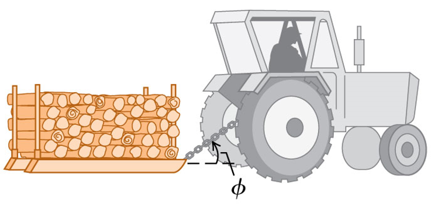
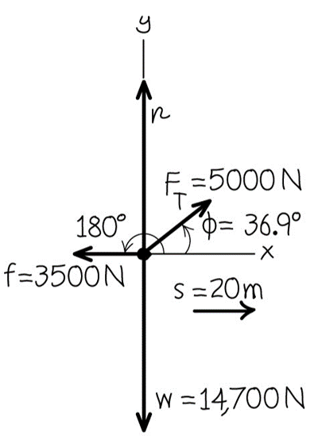
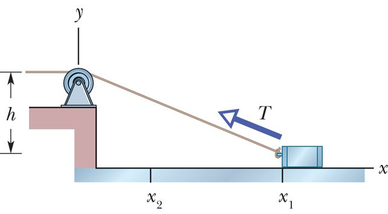

<link rel="stylesheet" href="../Resources/styles/base.css">
<!---This is for enabling LaTeX rendering in exports--->
<!---                  Do not remove                --->

# Physics Training Problems

## Mechanical energy problems

### Problem 1: Temple staircase
A person weighing `50.0 kg` decides to climb up the stairs of a temple `443.0 m` tall. In `15 minutes`, what must be the average power output of the person to be able to complete the staircase in time? Express your answer in watts and horsepower.

> 
Solution

> This is simple, first find the potential energy the person would have gained at the top.
> 
> Using $W = mgh$
>
> $$W = 50 \times 9.8 \times 443 = 217070 J$$
>
> After calculating the energy, simply divide it by 15 minutes, or 900 seconds.
>
> $$P = \dfrac{217070}{900}$$
>
> $$P = 241.19 \space W$$
>
> Just like that we have power, one horsepower is 745.7 Watts.
> $$241.19 \space W = 0.323 \space HP$$
>

### Problem 2: Tractor pulling a firewood sled

A farmer is pulling a sled of firewood `20.0 m` along level ground.
The sled weighs `14700.0 N`. The tractor exerts a constant `5000.0 N` force at an angle of `36.9°` above the griybd. A `3500.0 N` friction force opposes the sled’s motion. 

Find the overall work done on the sled. 

> 
Solution

> First, create a free body diagram to illustrate the forces on the sled.

>
> The forcces we can note are the **friction**, **tension** from the tractor, and the **weight**.
> Because work done is calculated using forces parallel to the direction of the displacement, we can effectively ignore **weight**.
> Do note things are different if the sled was inclined.
>
> To calculate the resultant force, we need to sum the resultant forces up:
>
> $$\sum{F} = 5000 \times \cos(36.9\degree) - 3500 = 498.42$$
> *Remember that the 5000N force is not perfectly parallel, so some parts of it are acting parallel and some are perpendicular. But we can use trigonometry to figure out the individual components, hence why $5000 \times \cos(36.9\degree)$.*
>
> After getting the total force, simply multiply by distance to get work done
>
> $$W = 498.42 \times 20 = 9968.4 J$$
> 
### Problem 3: Ball speeding down the runway
A ball starts from a runway at a height of `3.00 m`. It gains speed before being launched directly upwards reaching a height of `4.00 m`. Ignoring friction and air resistance, find the initial speed of the ball $\overrightarrow{v_0}$.

> 
Solution

> 
> One thing you can note first is that the height of the start of the ramp is different from the height the ball actually reaches.
>
> This means surely **extra energy is applied** at the start of the ramp.
>
> By the law of conservation of energy, the energy of the ball at the start must be equal to when it is at the peak. $W_0$ is the energy of the ball at the start, $W_1$ is the energy of the ball at the peak in the air.
>
> $$ \space W_0 = K_0 + U_0$$
> $$ \space W_1 = U_1$$
> *The reason $W_1$ only has $U_1$ in the equation is because when a particle has reached its peak in the air, all the kinetic energy has been converted to gravitational potential energy.*
>
> With these 2 equations, all we need to do is substitute any $K$ and $U$ where possible.
> $$ \space W_0 = \dfrac{1}{2}mv^2 + mgh$$
> $$ \space W_1 = mgh$$
>
> Using the given variables
> $$ \space W_0 = \dfrac{1}{2}mv^2 + m(9.8)(3)$$
> $$ \space W_1 = m(9.8)(4)$$
>
> Because we can ignore **air resistance** and **friction**. Then due to the conservation of energy, $W_0 = W_1$.
> $$m(9.8)(4) = \dfrac{1}{2}mv^2 + m(9.8)(3)$$
>
> Simply solve for $v$ using algebra and we have our answer.
>
> $$v = 4.427$$
> 

### Problem 4: Bluebird Skiers
The ski slopes at Bluebird Mountain make use of tow ropes to transport snowboarders and skiers to the summit of the hill. One of the tow ropes is powered by a `22.0 kW` motor which pulls skiers along an icy incline of `14.0°` at a constant speed. Suppose that `18` skiers with an average mass of `48.0 kg` hold onto the rope and suppose that the motor operates at full power.

- a. Determine the cumulative weight of all these skiers.
- b. Determine the force required to pull this amount of weight up a 14° incline at a constant speed.
- c. Determine the speed at which the skiers will ascend the hill.
> 
Solution

>
> To solve for **a.**, simply get the cumulative mass and multiply by gravity
>
> $$W_t = (48 \times 18) \times 9.8 = 8467.2 N$$
>Then to find out the force required to pull them, find the force exerted by gravity on the parallel axis. You need to use the angle of the incline here.
> $$\tan(14°) = \dfrac{F_x}{8467.2}$$
>
> $$0.249 \times 8467.2 = F_x = 2111.11 N$$
>
> And to find the speed at which the skiers will ascend. Find the distance first at which the skiers will be carried in 1 second.
>
> $$22000 = 2111.11 \times d$$
>
> $$d = 10.42 \space m$$
>
> That distance might as well be the speed the skiers will ascend.
>
> $$v = 10.42 \space m/s$$
>
### Problem 5: Pulley doing work
 A cord is attached to a cart that can slide along a frictionless ground. A cord sits at `1.20 m` above the ground, and the cart slides from the `3.00 m` point $x1$ to the `1.00 m` point $x2$. During the move, the tension in the cord is a constant `25.0 N`. What is the change in the kinetic energy of the cart during the move?

> 
Solution

>
> To find the work done, we need to know the
>
> $$$$

You have reached the end
