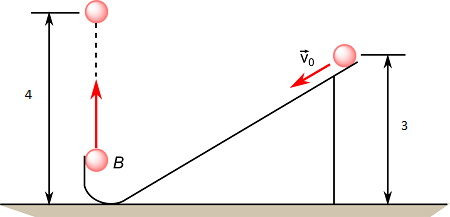

<link rel="stylesheet" href="../Resources/styles/base.css">
<!---This is for enabling LaTeX rendering in exports--->
<!---                  Do not remove                --->

# Physics Sample Problems
In this section, problems for each topics are provided to help train the application of the formulas.

### Energy related problems
#### Problem 1: Ball speeding down the runway
A ball starts from a runway at a height of `3.00 m`. It gains speed before being launched directly upwards reaching a height of `4.00 m`. Ignoring friction and air resistance, find the initial speed of the ball $\overrightarrow{v_0}$.

> 
Solution

> 
> One thing you can note first is that the height of the start of the ramp is different from the height the ball actually reaches.
>
> This means surely **extra energy is applied** at the start of the ramp.
>
> By the law of conservation of energy, the energy of the ball at the start must be equal to when it is at the peak. $W_0$ is the energy of the ball at the start, $W_1$ is the energy of the ball at the peak in the air.
>
> $$ \space W_0 = K_0 + U_0$$
> $$ \space W_1 = U_1$$
> *The reason $W_1$ only has $U_1$ in the equation is because when a particle has reached its peak in the air, all the kinetic energy has been converted to gravitational potential energy.*
>
> With these 2 equations, all we need to do is substitute any $K$ and $U$ where possible.
> $$ \space W_0 = \dfrac{1}{2}mv^2 + mgh$$
> $$ \space W_1 = mgh$$
>
> Using the given variables
> $$ \space W_0 = \dfrac{1}{2}mv^2 + m(9.8)(3)$$
> $$ \space W_1 = m(9.8)(4)$$
>
> Because we can ignore **air resistance** and **friction**. Then due to the conservation of energy, $W_0 = W_1$.
> $$m(9.8)(4) = \dfrac{1}{2}mv^2 + m(9.8)(3)$$
>
> Simply solve for $v$ using algebra and we have our answer.
>
> $$v = 4.427$$
> 

You have reached the end
